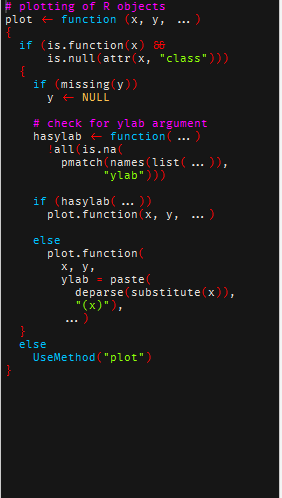

# rstudio-theme
This repo contains my custom rstudio theme and is mostly here so I can track any additional changes that I may make to different styles and because each time I update to a new version of RStudio I will have to likely replace the default versions of the styles. 

This was down by following the instructions in [this blog post](https://www.statworx.com/de/blog/make-rstudio-look-the-way-you-want-because-beauty-matters/) 

Current custom themes can only be applied by overwriting a default theme shipped with RStudio. The current themes that I have created custom versions for are:

  * Merbivore (file path: 'Program Files/RStudio/www/rstudio/F07DA73971CDED01DD856A58DF4F63F8.cache.css')
    
    
    
    Changes made: 
      
      1. changed function color to bright blue (I have the option to "Highlight R function call" selected in my global options)
      2. changed the color of paranthesis, assignment operators, commas, and equal signs to a bright red. This is something I consider important as it allows me to more easily track my paranthesis
      3. changed comments to a bight purple color and removed the italics to make them easier to read. 
      
    
